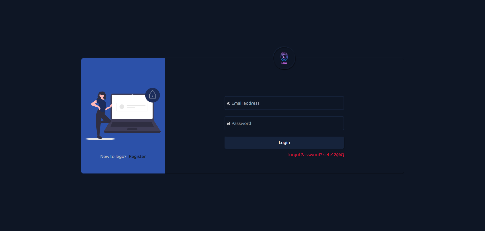
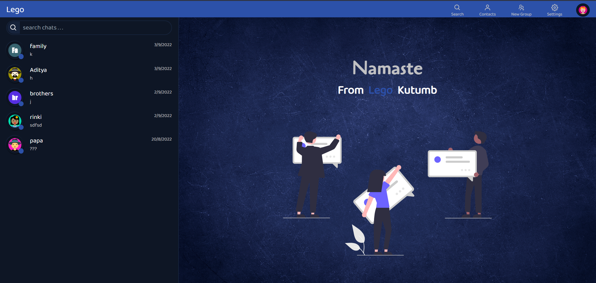
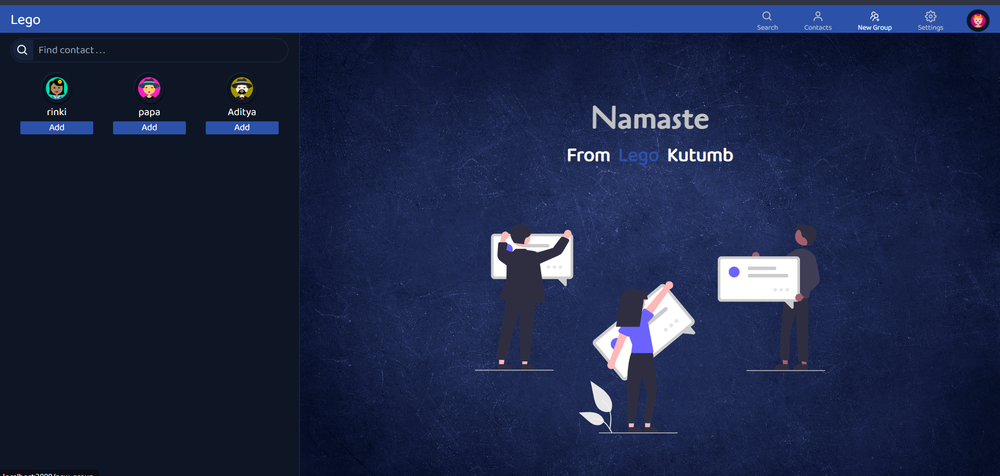
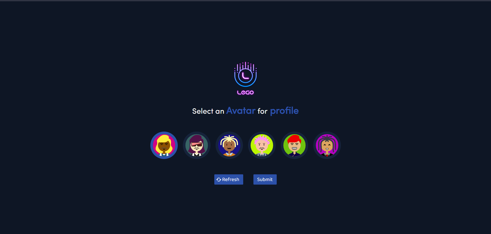

# Lego A Chat App (MERN Project)

Lego A Chat App is a full-stack MERN (MongoDB, Express.js, React, Node.js) project that offers real-time chat functionality. Here are some key features:

-  **Email Authentication**: Users can sign up and log in using their real email addresses for secure access.
-  **Chat Section**: A user-friendly chat interface that enables real-time messaging between users.
-  **User Search**: Find and connect with other users within the application.
-  **Message History**: Keep track of all messages within a particular chat or conversation.

The project boasts an impressive user interface and rich functionality, making it a promising solution for real-time chat applications.

## Tech Stack

## Getting Started

To run the project locally:

1. Clone this repository.
2. Install dependencies: `npm install`.
3. Start the development server: `npm start`.

Open your browser and visit [http://localhost:3000](http://localhost:3000) to view the application.

## Contributing

Contributions are welcome! Feel free to open issues or submit pull requests to help improve this project.

## License

This project is licensed under the MIT License. See the [LICENSE](./License) file for details.

## Acknowledgments

-  Thanks to the creators of similar chat applications for inspiration.
-  Icons made by [ReactIcons](https://react-icons.github.io/).
